# 🗺️ Mapa Serwisu - Portal

Dokumentacja struktury plików i katalogów projektu. Pozwala szybko zorientować się, za co odpowiadają poszczególne pliki i foldery.

---

## 📁 Struktura katalogów

```
portal/
├── frontend/                 # React aplikacja (UI)
│   ├── src/
│   │   ├── components/      # Komponenty UI (np. Navbar, LayoutCustomization)
│   │   ├── pages/           # Strony (np. Home, Login, Register)
│   │   ├── contexts/        # Context API (np. AuthContext)
│   │   └── styles/          # Style globalne (styled-components)
│   └── public/              # Pliki statyczne (favicon, index.html)
├── backend/                 # Node.js API (Express)
│   ├── controllers/         # Logika endpointów (np. userController.js)
│   ├── models/              # Modele Mongoose (np. User.js)
│   ├── routes/              # Definicje endpointów (np. userRoutes.js)
│   ├── middleware/          # Middleware (np. authMiddleware.js)
│   ├── modules/             # Moduły systemu (np. gamification)
│   └── services/            # Integracje zewnętrzne
├── scripts/                 # Skrypty pomocnicze (np. migracje)
├── docs/                    # Dokumentacja
├── MAPA_SERWISU.md          # Ten plik - mapa serwisu
└── ...
```

---

## 📦 Najważniejsze pliki i foldery

### FRONTEND (`frontend/`)
- **src/App.js** – Główny plik aplikacji React, routing, ThemeProvider, wybór layoutu i motywu
- **src/components/** – Komponenty UI:
  - **Navbar.jsx** – Pasek nawigacji, menu profilu
  - **LayoutCustomization.jsx** – Panel zmiany wyglądu (layout, motyw, kolory)
  - **Profile.jsx** – Profil użytkownika
  - **ShopCreate.jsx, ShopManagement.jsx** – Tworzenie i zarządzanie sklepami
  - **ProductList.jsx, ProductCreate.jsx, ProductManagement.jsx** – Produkty
- **src/pages/** – Strony aplikacji:
  - **Home.jsx** – Strona główna
  - **Login.jsx, Register.jsx** – Logowanie i rejestracja
  - **AdminPanel.jsx** – Panel administracyjny
- **src/contexts/AuthContext.jsx** – Zarządzanie autoryzacją, logowaniem, tokenem
- **src/styles/GlobalStyles.js** – Style globalne, definicje motywów (light/dark)
- **src/setupProxy.js** – Proxy do backendu podczas developmentu

### BACKEND (`backend/`)
- **server.js** – Główny plik serwera Express, konfiguracja CORS, socket.io, rejestracja tras
- **controllers/** – Logika endpointów:
  - **userController.js** – Rejestracja, logowanie, ustawienia użytkownika, layout, motyw
  - **shopController.js, productController.js** – Sklepy, produkty
- **routes/** – Definicje endpointów:
  - **userRoutes.js** – `/api/users` (logowanie, rejestracja, ustawienia)
  - **shopRoutes.js, productRoutes.js** – `/api/shops`, `/api/products`
- **models/** – Modele bazy danych (User.js, Shop.js, Product.js)
- **middleware/authMiddleware.js** – Middleware autoryzacji JWT
- **modules/** – Moduły dodatkowe (np. gamification, messaging)

### INNE
- **render.yaml** – Konfiguracja deployu na Render (zmienne środowiskowe, build)
- **DEPLOY.md** – Instrukcje deployu, debugowania, uruchamiania
- **README.md** – Główna dokumentacja projektu

---

## 🔎 Szybka nawigacja po funkcjach

- **Zmiana wyglądu:**
  - Frontend: `src/components/LayoutCustomization.jsx`, `src/App.js`
  - Backend: `controllers/userController.js` (saveLayoutSettings, getLayoutSettings)
- **Logowanie:**
  - Frontend: `src/pages/Login.jsx`, `src/contexts/AuthContext.jsx`
  - Backend: `controllers/userController.js` (login), `routes/userRoutes.js`
- **Panel admina:**
  - Frontend: `src/pages/AdminPanel.jsx`, `src/components/Navbar.jsx`
- **Google Maps:**
  - Frontend: `src/components/MapSelector.jsx`

---

## 📝 Jak korzystać?
- Szukasz funkcji? Sprawdź sekcję „Szybka nawigacja po funkcjach”
- Chcesz zmienić wygląd? Edytuj `LayoutCustomization.jsx` i motywy w `App.js`/`GlobalStyles.js`
- Chcesz dodać endpoint? Dodaj trasę w `routes/`, logikę w `controllers/`, model w `models/`

---

**Aktualizuj ten plik po każdej większej zmianie w strukturze!** 

---

## 🗂️ Schemat blokowy serwisu (Mermaid) - ROZBUDOWANY



---

## 🔄 Szczegółowe przepływy funkcji

### 1. **Logowanie i rejestracja**
```
Login.jsx → AuthContext.jsx → /api/users/login → userController.js → User.js (MongoDB)
Register.jsx → AuthContext.jsx → /api/users/register → userController.js → User.js (MongoDB)
```

### 2. **Zmiana wyglądu**
```
LayoutCustomization.jsx → /api/users/layout-settings → userController.js → User.js → App.js (re-render)
```

### 3. **Panel administracyjny**
```
AdminPanel.jsx → /api/admin/* → adminController.js → wszystkie modele → DataManager.jsx
```

### 4. **Lokalizacje i mapy**
```
LocationSearch.jsx → /api/locations/search → locationController.js → Location.js + GUS API
MapSelector.jsx → Google Maps API → locationController.js
```

### 5. **Komunikacja**
```
MessagingSystem.jsx → /api/messages/* → messageController.js → Message.js + Socket.IO
```

### 6. **Gamifikacja**
```
GamificationPanel.jsx → /api/gamification/* → gamification module → User.js (punkty, odznaki)
```

### 7. **Płatności**
```
PaymentSystem.jsx → payments module → Payment Gateway → Order.js
```

### 8. **Powiadomienia**
```
Notifications.jsx → /api/notifications/* → notificationController.js → Notification.js + SMTP
```

---

**Jak czytać diagram?**
- **Strzałki** = przepływ danych i zależności
- **Bloki** = pliki i komponenty
- **API** = komunikacja HTTP
- **WebSocket** = komunikacja real-time
- **External** = integracje zewnętrzne (Google Maps, GUS, SMTP, płatności)

---

**Możesz ten diagram wkleić do edytora obsługującego Mermaid i zobaczyć pełną architekturę serwisu!** 

---

## 🔄 **Aktualizacje na bieżąco**

### **Automatyczne aktualizacje dokumentacji:**
- **MAPA_SERWISU.md** - Aktualizowany po każdej zmianie struktury plików
- **SCHEMAT_PRACY.md** - Aktualizowany po zmianach w procesach zespołu
- **README.md** - Aktualizowany po dodaniu nowych funkcjonalności

### **Workflow aktualizacji:**
```
Zmiana kodu → Testy → Code Review → Merge → Aktualizacja dokumentacji → Deploy
```

### **Monitoring zmian:**
- **Git hooks** - Automatyczne sprawdzanie dokumentacji
- **CI/CD** - Weryfikacja aktualności dokumentacji
- **Regularne audyty** - Miesięczne sprawdzanie aktualności

---

## 📋 **Status aktualizacji**

### **Ostatnie aktualizacje:**
- ✅ **MAPA_SERWISU.md** - Rozbudowany schemat blokowy (2024-07-11)
- ✅ **SCHEMAT_PRACY.md** - Utworzony schemat pracy zespołu (2024-07-11)
- ✅ **Backend CORS** - Naprawiona konfiguracja CORS (2024-07-11)
- ✅ **Layout Customization** - Naprawiona zmiana wyglądu (2024-07-11)
- ✅ **Testy e2e** - Implementacja Cypress + GitHub Actions (2024-07-11)

### **Planowane aktualizacje:**
- [ ] **Monitoring** - System metryk i alertów
- [ ] **Security audit** - Regularne audyty bezpieczeństwa
- [ ] **Performance optimization** - Optymalizacja wydajności
- [ ] **Mobile testing** - Testy na urządzeniach mobilnych

---

## 🎯 **Symulacja zespołu AI - Status**

### **Aktywne role:**
- **🧑‍💻 Programiści** - Rozwój funkcjonalności, bugfixy
- **🧪 QA/Testerzy** - Przygotowanie testów e2e
- **🔒 Security** - Audyt CORS, autoryzacji
- **🎨 UX/UI** - Analiza zmiany wyglądu
- **📈 Marketing** - Monitoring metryk
- **🧠 Psycholog** - Analiza UX flow

### **Codzienne działania:**
- Uruchamianie testów automatycznych
- Code review i analiza bezpieczeństwa
- Monitoring performance i błędów
- Aktualizacja dokumentacji

---

**Aktualizuj ten plik po każdej większej zmianie w strukturze!** 